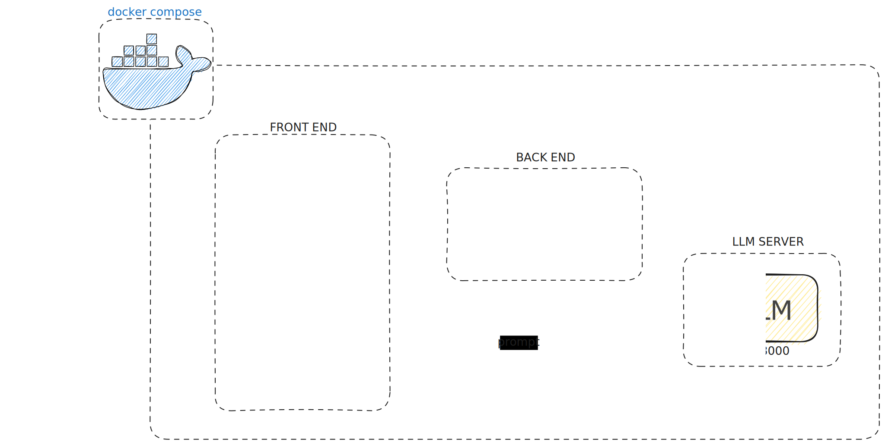
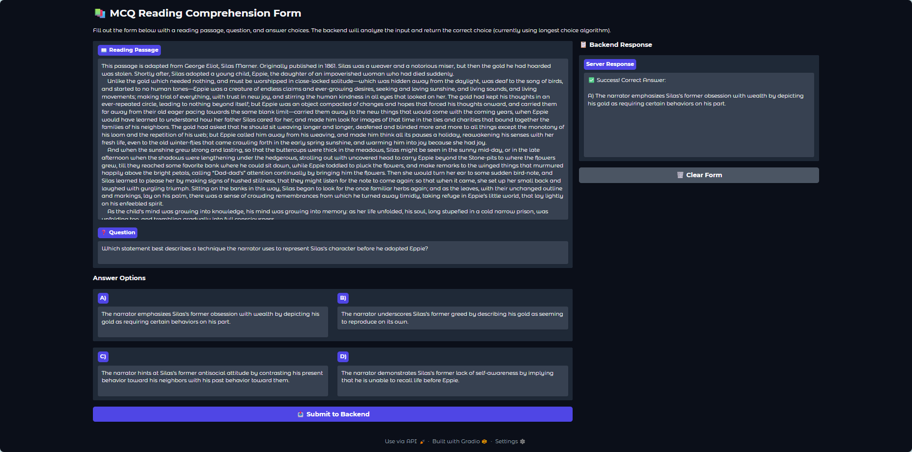
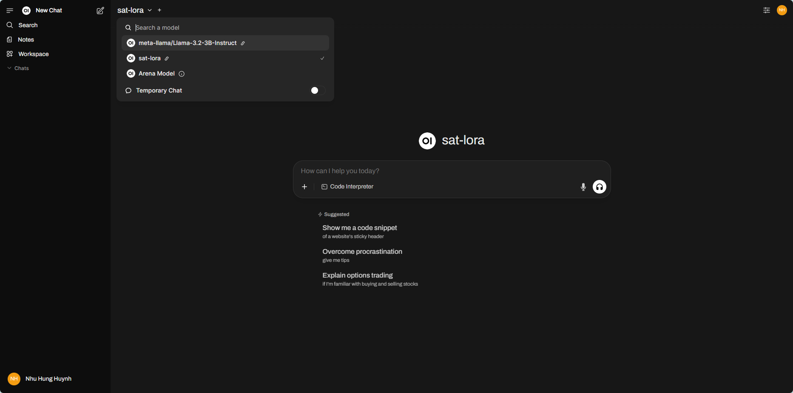
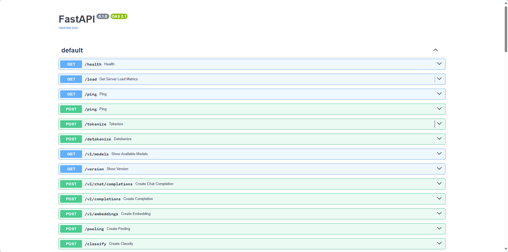
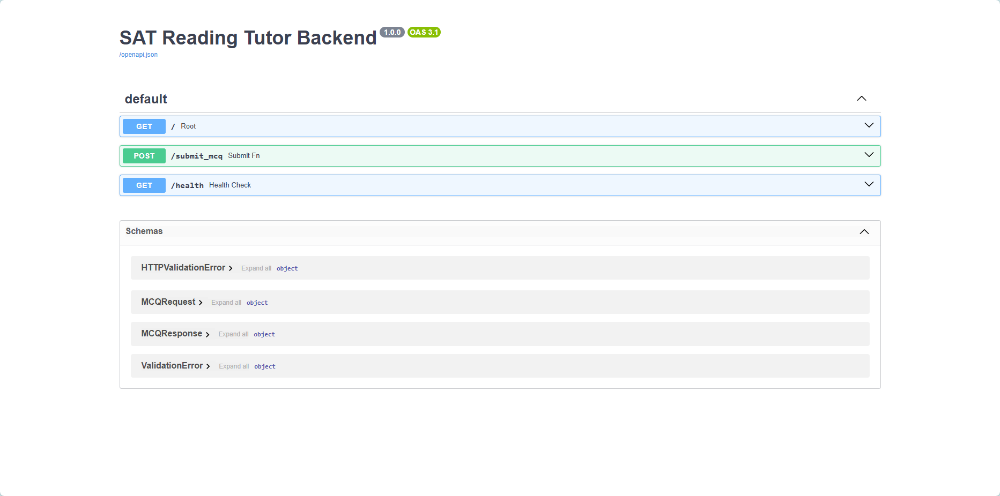

# LLM-FineTuning-SAT-Reading

An intelligent SAT Reading comprehension tutor powered by a fine-tuned, quantized LLaMA 3.2 3B model with LoRA adapters, deployed with Open-WebUI, FastAPI, LangChain, and vLLM. This project demonstrates end-to-end machine learning deployment using modern containerization and microservices architecture for educational AI applications.



## Table of Contents
- [Project Status](#project-status)
- [Overview](#overview)
- [Quick Start](#quick-start)
- [Architecture](#architecture)
- [Model configuration for fine-tuning](#model-configuration-for-fine-tuning)
- [API Usage](#api-usage)
- [License & Citation](#license--citation)

## Project Status

### Completed
- [x] **Model Development**: LLaMA 3.2 3B + 4-bit quantization + LoRA fine-tuning (73.68% accuracy)
- [x] **Core Architecture**: FastAPI backend, Gradio frontend, VLLM inference
- [x] **Containerization**: Docker + Docker Compose orchestration
- [x] **API Integration**: OpenAI-compatible endpoints
- [x] **Performance**: prefix caching and vLLM optimizations for throughput and latency

### In Progress
- [ ] **Benchmarking**: integration and performance testing
- [ ] **Monitoring**: Logging, metrics, and error tracking with LangSmith, Loki, Prometheus, and Grafana
- [ ] **Answer Explanations**: Enhance prompts to generate detailed explanations with step-by-step reasoning

### Planned
- [ ] **Enhanced Features**: Multi-model support, Multi-LoRA
- [ ] **CI/CD**: Kubernetes deployment and cloud integration via ArgoCD
- [ ] **Model registry**: Implement a model registry for versioning various fine-tuned models
- [ ] **Question bank with RAG**: Implement a question bank with Retrieval-Augmented Generation (RAG) for dynamic question retrieval
- [ ] **Import and Export Features**: Allow users to import questions and export practice session results and progress reports
- [ ] **Data Persistence**: Database integration for storing user data and question responses
- [ ] **Timed Practice**: Implement realistic SAT timing constraints and practice modes
- [ ] **Authentication**: Simple user authentication and authorization system
- [ ] **Rate Limiting**: API rate limiting and request throttling to prevent abuse

## Overview

This system implements a specialized AI tutor that achieves:
- **73.68% accuracy** on SAT Reading comprehension tasks (compared to 47.37% baseline), demonstrating a **+26.31 percentage point improvement** through domain-specific fine-tuning
- **82% VRAM savings** through **4-bit quantization** for efficient inference, reducing model size to **2.28 GB VRAM** while maintaining performance
- **6.3x higher throughput** with vLLM as opposed to static batching, and **40% latency reduction** via prefix caching, resulting in **~1.8s per question**
- **99.25% parameter efficiency** with **LoRA fine-tuning** using only 24.3M trainable parameters (0.75% of total)

### Key Features
- Interactive web interface for SAT practice using Gradio
- RESTful, OpenAI-compliant backend processing with vLLM
- Real-time model comparison (`arena` mode) and preference feedback with Open WebUI
- Accelerated development using LangChain for LLM orchestration
- Production-ready deployment with Docker containerization and microservices architecture




## Quick Start

### Prerequisites

#### Hardware Requirements
- **GPU**: NVIDIA GPU with CUDA support (minimum 8GB VRAM recommended)
- **RAM**: 16GB+ system memory for optimal performance
- **Storage**: 60GB+ available disk space for models and containers

#### Software Requirements
- Docker and Docker Compose installed on your system
- NVIDIA Container Toolkit installed and configured
- CUDA-compatible GPU drivers

### Environment Setup
Copy the example environment file and customize configuration:

```cmd
copy .env.example .env
```

Edit the `.env` file to customize your deployment:

```bash
# Host Configuration
HOST=0.0.0.0                    # Set to 0.0.0.0 for Docker deployment

# Port Configuration  
VLLM_PORT=8000                  # VLLM inference server
OPEN_WEBUI_PORT=8080           # Open WebUI interface
BACKEND_PORT=8090              # FastAPI backend
FRONTEND_PORT=7860             # Gradio frontend

# Model Configuration
BASE_MODEL=meta-llama/Llama-3.2-3B-Instruct
LORA_MODEL=tiviluson/Llama-3.2-3B-SAT
SAT_LORA_MODEL_NAME=sat-lora
MAX_MODEL_LEN=2048             # Maximum context length

# API Configuration
VLLM_API_KEY=EMPTY
VLLM_API_BASE_URL=http://vllm_app:8000/v1
OPENAI_API_BASE_URL=http://vllm_app:8000/v1
BACKEND_URL=http://backend:8090/submit_mcq
```

### Run the Application

Build and start all services:
```cmd
docker-compose up
```

Once running, access the services:
- **Frontend (Gradio UI)**: http://localhost:7860 - Main SAT practice interface
- **Backend API**: http://localhost:8090 - REST API endpoints  
- **Open WebUI**: http://localhost:8080 - Chat-based model interaction
- **VLLM API**: http://localhost:8000/docs - OpenAI-compatible API docs

## Architecture

The application consists of four containerized microservices orchestrated via Docker Compose. Services communicate via internal Docker network `sat-network` for security and performance.

### Project Structure
```
├── backend_server.py           # FastAPI backend implementation
├── frontend.py                # Gradio frontend interface  
├── sat_chain.py               # LangChain orchestration logic
├── docker-compose.yaml        # Service orchestration
├── Dockerfile.backend         # Backend container definition
├── Dockerfile.frontend        # Frontend container definition
├── requirements-backend.txt   # Backend Python dependencies
├── requirements-frontend.txt  # Frontend Python dependencies
├── .env.example              # Environment configuration template
└── LLM_FineTuning_SAT_Reading_042325.ipynb  # Fine-tuning notebook
```

### System overview

#### VLLM Service (`vllm_app`)
- **Image**: `vllm/vllm-openai:latest`
- **Purpose**: High-performance LLM inference server
- **Model**: LLaMA 3.2 3B with SAT-specific LoRA adapters
- **Features**:
  - GPU acceleration with NVIDIA runtime
  - LoRA adapter support with runtime updating
  - OpenAI-compatible API endpoints
  - Prefix caching for improved throughput
- **Port**: 8000



#### Backend Service (`backend`)
- **Framework**: FastAPI with Uvicorn ASGI server
- **Language**: Python 3.11
- **Purpose**: prompt processing and LLM orchestration
- **Features**:
  - RESTful API with automatic OpenAPI documentation
  - CORS middleware for cross-origin requests
  - Pydantic models for request/response validation
  - Prompt formatting with LangChain
  - Health check endpoints
- **Port**: 8090



#### Frontend Service (`frontend`)
- **Framework**: Gradio
- **Purpose**: Interactive web interface for SAT practice
- **Features**:
  - Reading passage input (multi-line text area)
  - Question input field
  - Four multiple-choice options (A, B, C, D)
  - Real-time API communication with backend
- **Port**: 7860


#### Open WebUI Service (`open-webui`)
- **Image**: `ghcr.io/open-webui/open-webui:main`
- **Purpose**: Alternative chat-based interface for direct model interaction
- **Features**:
  - ChatGPT-like interface
  - Direct model conversation
  - Conversation history
  - Model comparison (`arena` mode)
  - User feedback collection
- **Port**: 8080


## Model configuration for fine-tuning

### Model Architecture
- **Base Model**: `meta-llama/Llama-3.2-3B-Instruct` (3.24B parameters)
- **Fine-Tuning**: LoRA (Low-Rank Adaptation) with 24.3M trainable parameters (0.75% of total)
- **Quantization**: 4-bit NF4 with double quantization (bfloat16 compute)
- **Fine-Tuned Model**: `tiviluson/Llama-3.2-3B-SAT`

### Quantization Configuration
```python
# Quantization Configuration
bnb_config = BitsAndBytesConfig(
    load_in_4bit=True,
    bnb_4bit_use_double_quant=True,
    bnb_4bit_quant_type="nf4",
    bnb_4bit_compute_dtype=torch.bfloat16
)
```

### LoRA Configuration
```json
{
  "r": 16,
  "lora_alpha": 32,
  "lora_dropout": 0.05,
  "target_modules": ["up_proj", "o_proj", "q_proj", "gate_proj", "down_proj", "k_proj", "v_proj"]
}
```

### Training Configuration
```python
training_args = TrainingArguments(
    per_device_train_batch_size=1,
    gradient_accumulation_steps=2,
    num_train_epochs=2,
    learning_rate=2e-4,
    fp16=True,
    optim="paged_adamw_8bit",
    lr_scheduler_type="cosine",
    warmup_ratio=0.05
)
```


## API Usage

### Backend API Examples

#### Submit MCQ Request
```bash
curl -X POST "http://localhost:8090/submit_mcq" \
  -H "Content-Type: application/json" \
  -d '{
    "text": "Reading passage here...",
    "question": "What is the main idea?",
    "choices": ["A) Option 1", "B) Option 2", "C) Option 3", "D) Option 4"]
  }'
```

### VLLM API Examples

#### Direct Completions
```bash
curl -X POST "http://localhost:8000/v1/completions" \
  -H "Content-Type: application/json" \
  -d '{
    "model": "sat-lora",
    "prompt": "Your prompt here"
  }'
```

### API Endpoints

#### Backend Service
- `POST /submit_mcq` - Process SAT reading comprehension questions
- `GET /health` - Service health check
- `GET /` - Root endpoint with service information

#### VLLM Service
- `GET /docs` - OpenAPI documentation
- `POST /v1/completions` - OpenAI-compatible text completion
- `POST /v1/chat/completions` - Chat-based completions
- `GET /v1/models` - Available model information

### Request/Response Schema

```python
# MCQ Request Model
class MCQRequest(BaseModel):
    text: str          # Reading passage
    question: str      # Question text  
    choices: List[str] # Multiple choice options

# MCQ Response Model  
class MCQResponse(BaseModel):
    answer: str        # Selected answer with explanation
```


## License & Citation

### License
This project is licensed under the MIT License - see the [LICENSE](LICENSE) file for details.

### Citation
If you use this project in your research, please cite:

```bibtex
@misc{llm-finetuning-sat-reading,
  title={LLM Fine-Tuning for SAT Reading Comprehension},
  author={tiviluson},
  year={2024},
  url={https://github.com/tiviluson/LLM-FineTuning-SAT-Reading}
}
```